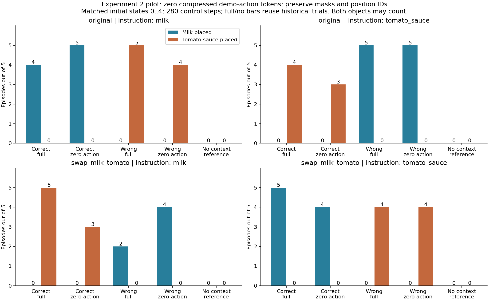

# 实验 2：示范 action 表示置零（低成本试验）

**主要观察：显式 action 表示置零后，示范原位置上的物体仍在 32/40 次试验中被放入篮子；完整示范为 34/40。**

原始布局的 wrong-context 中，置零后另一物体入篮 9/10 次，语言目标入篮 0/10 次，两者均未入篮 1/10 次。本次仍保留了错误物体操作：显式 action 模态不是这一行为在本干预下出现的唯一来源，保留的状态/图像等信息仍可能支持它。不能据此断言原模型不使用 action。

交换位置后 wrong-context 的语言目标成功若增加，也可能仍是原位置占据者被更顺利地放入篮子，不应直接解释成更遵循语言。本次 40 对中，`other_only → language_only` 为 0 对，`other_only → neither` 为 4 对；必须区分纠正与失败。

新增轨迹累计运行约 14.6 分钟（不含模型加载、运行前校验和汇总）；attention 已保存但尚未判读。

本报告使用每条件 5 次试验，新增 40 条完整 rollout。结果用于决定下一步实验，不能替代每条件 25 次或跨更多初始状态的确认实验。具体结果见下表；“完整示范”和 no-context 均复用历史运行中同一初始状态索引 0–4，不把历史 25 次比例与本次 5 次直接比较。

## 做了什么

- 场景固定为番茄酱场景；2 条语言 × 2 种布局 × correct/wrong = 8 个新增条件，各 5 次。
- 将示范 action 经投影和 Perceiver 压缩后的 32 个 token **在进入 Gemma 前置零**。保留 token 槽位、有效 mask、位置编号；示范图像和状态保持原样。
- 不是给机器人发送零动作，也不是把原始示范改成一段静止动作；不是训练过的 null embedding。此干预可能 OOD。
- 固定 280 个控制步，每 5 步重规划；任何物体入篮都不会提前结束。视频为原速 20 FPS。
- 基线是此前位置交换实验，不是实验 0 的一致性检查。本次也没有修改旧 no-context，未重跑其闭环轨迹。

## 结果

下表为 **完整示范 → action 表示置零**。“另一物体”指牛奶与番茄酱中未被当前语言指定的那个；“两者都未入篮”不等同于完全不动，也不排除操作其他干扰物。

| 布局 | 语言目标 | context | 语言目标入篮 | 另一物体入篮 | 两者都未入篮 |
|---|---|---|---:|---:|---:|
| original | milk | correct | 4/5 → 5/5 | 0/5 → 0/5 | 1/5 → 0/5 |
| original | milk | wrong | 0/5 → 0/5 | 5/5 → 4/5 | 0/5 → 1/5 |
| original | tomato_sauce | correct | 4/5 → 3/5 | 0/5 → 0/5 | 1/5 → 2/5 |
| original | tomato_sauce | wrong | 0/5 → 0/5 | 5/5 → 5/5 | 0/5 → 0/5 |
| swap_milk_tomato | milk | correct | 0/5 → 0/5 | 5/5 → 3/5 | 0/5 → 2/5 |
| swap_milk_tomato | milk | wrong | 2/5 → 4/5 | 0/5 → 0/5 | 3/5 → 1/5 |
| swap_milk_tomato | tomato_sauce | correct | 0/5 → 0/5 | 5/5 → 4/5 | 0/5 → 1/5 |
| swap_milk_tomato | tomato_sauce | wrong | 4/5 → 4/5 | 0/5 → 0/5 | 1/5 → 1/5 |

所有 40 对试验的 outcome 转换：

- `neither -> language_only`：5 对
- `language_only -> language_only`：11 对
- `neither -> neither`：1 对
- `language_only -> neither`：3 对
- `other_only -> other_only`：16 对
- `other_only -> neither`：4 对

`language_only`/`other_only`/`both`/`neither` 使用整条轨迹中是否曾满足 LIBERO 入篮谓词判定。完整计数含干扰物、示范物体、示范原位置占据者，见 [comparison.csv](comparison.csv)。逐次配对结果见 [paired_outcomes.csv](paired_outcomes.csv)，可点击的配对视频入口见 [VIDEO_INDEX.md](VIDEO_INDEX.md)。

## 为什么这还不能直接证明 action 的因果重要性

置零可能产生训练中未出现的表示；性能下降可能来自分布偏移。若 wrong 下错误行为减少但 correct 同样崩溃，不能称为纠正了示范误导。若 wrong 下语言目标成功增加而 correct 保持，才是更有针对性的线索，仍需要更大样本或其他干预确认。

此外，示范图像与状态还包含运动信息。本实验只移除显式 action 模态通过这些压缩 token 输入 Gemma 的路径，不是移除所有动作线索。零 token 保留有效槽位，后续层还能向这些位置写入来自其他模态的信息，因而其 attention 不要求为零。

## 验证与配对

- 启动前，当前完整示范模型在 60 份历史初始观测上的原始完整动作及输出变换后动作，与实验 0 保存结果逐字节一致。
- 12 份实际检查点样本上，置零前后的非 action prefix、mask、位置编号精确一致；32 个 action token 为零；记录 attention 不改变消融后动作。
- 8 份 correct/wrong 样本中，再改变原始示范 action 的数值，消融输出仍完全相同；4 份 no-context 样本的输出不受此置零影响。
- 40 条新增轨迹与历史对应项的初始模拟器状态、初始图像/状态 hash、环境 seed、示范 episode、各次推理随机 seed 全部匹配。
- 全部动作有限；保存轨迹的入篮谓词与汇总一致；实验前后模型参数 SHA256 一致。

## 保留的 attention

保存环境步 0、80、160，共 **120 份**原始 attention 及对应观测；每份含采样步 0/5/9、层 0/9/17、全部 8 个 heads、51 个 queries、1027 个 keys。每次采集同时验证记录关闭/开启的动作精确相同。已核对这些动作的前 5 步确实是后续执行的动作。

本次不判读热图，也没有预先平均数据。[attention_manifest.json](attention_manifest.json) 给出全部位置与 checksum。中后期画面会随行为分化，不能当成相同观测对照。

## 关于之前 no-context 的位置编码问题

问题是在实验 1 解读已有 no-context 记录时发现的：原模型用有效 prefix mask 的累积计数产生位置编号。全部示范 mask 关闭后，在牛奶示例中有效 prefix 从 652 降到 524，首个 action 位置编号从 653 变为 525。它影响“无示范为何改变注意力”的解释；没有使已经执行的行为记录或成功率成为无效数据，但 no-context 不再是只移除语义、其余结构全保持的对照。

这个定义已用于之前的 correct/no/wrong 行为实验及位置交换实验的 no 分组，也进入实验 0/1 的 no 记录。correct/wrong 分组及原 Table 1 完整示范复现不涉及这一变化。实验 0 的记录开/关一致性结论也不受影响，因为两条路径使用同样的 mask。

此前只增加了说明，**没有修复旧实现或重跑旧结果**。本次 action-only 置零保留 mask，因此不引入这项位置变化。mask=false 与表示置零并不等价。

相关文件：[代码修改报告](CODE_CHANGES.md)、[机器可读结果](comparison.json)、[复用基线索引](baseline_references.json)。
