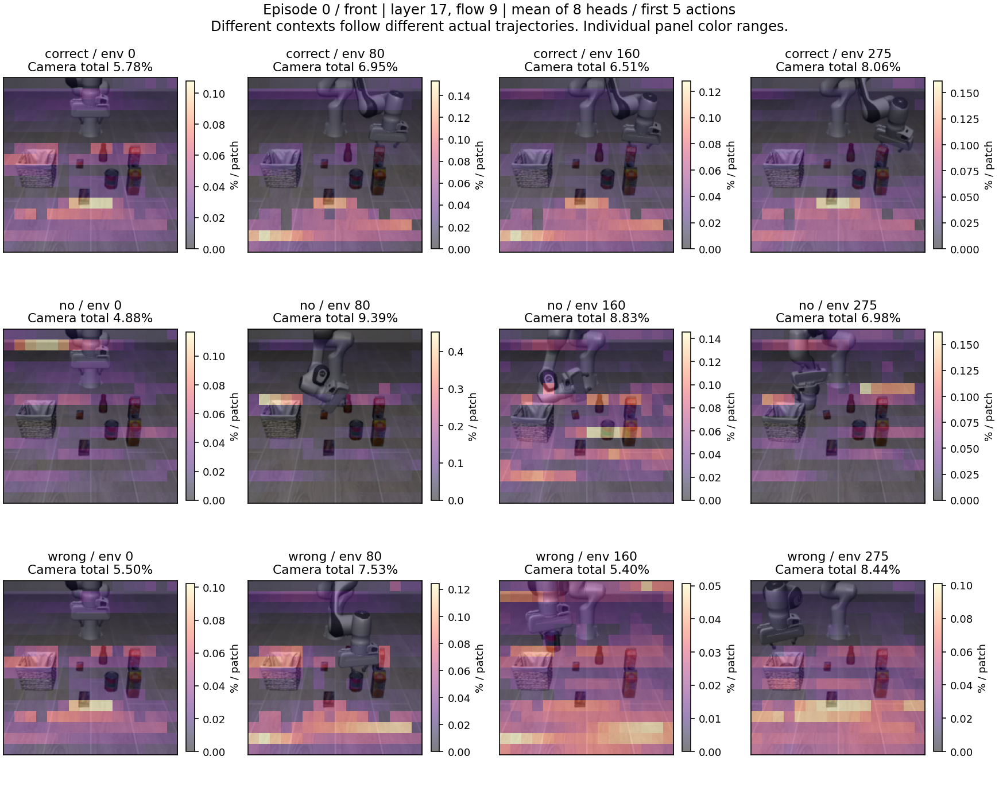
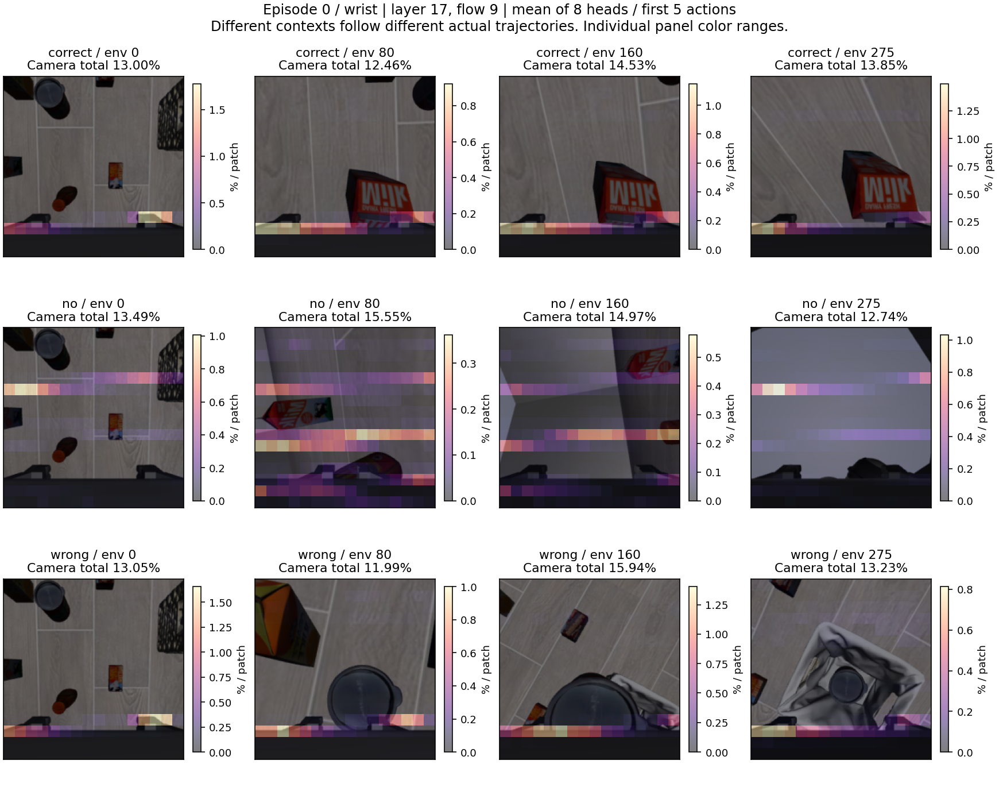

# 实验 1：牛奶任务的整条轨迹 attention 播放器

打开 [交互页面](index.html)，拖动控制步 0–280。页面自包含图片和数据，下载单个 HTML 后即可离线使用；切换其他初始状态需要同目录的其余 HTML 文件。

## 原来保存了什么，这次补了什么

原实验保存了全部 280 个控制动作、逐步机器人/物体状态和主视角视频。此前 attention 只采集了环境步 0、80、160，并不代表其他轨迹丢失。

本次对牛奶语言、原始布局、correct/no/wrong、初始状态 0–4 共 **15 条原轨迹**进行完整确定性回放。每条导出 **281 个观测状态**（初始 0，加执行 280 次动作后的状态），两台相机都可逐帧查看。每 5 步模型才重新规划，所以真实模型调用时刻为 **0、5、10……275，共 56 次**；共补采 **840 次** attention。不是在每个控制步强行增加一次模型调用。

模型每次生成 50 个动作，原实验只执行前 5 个再规划。因此页面继续平均前 5 个 action queries 和 8 个 heads，可切换保存的层 0/9/17、采样步 0/5/9。

## 拖动条怎样与 attention 对齐

每个 context、每台相机并排显示两张图：

- **当前状态图**：严格对应拖动条控制步 t。
- **最近规划的热图**：对应 u = 5 × floor(t/5)，最高为 275；背景也是 u 时刻的图像，绝不把旧热图叠到 t 时刻的新画面上。

例如拖到 83，左图是环境步 83，右图是环境步 80 那次规划的 attention；81–84 没有新的模型调用。到 280 时轨迹结束，右图明确标为最后一次规划 275。按钮可逐控制帧或逐规划点移动，也可按原速 20Hz 播放。机器性能不足时显示可能跳帧；拖动仍可定位所有已保存状态。

页面同时显示机器人末端状态、两种目标物体当前/曾经入篮状态，并可跳到首次入篮事件。曲线展示每次真实规划时，两台相机分别分到的 attention 总量。

## 配对与复现检查

- 每条回放核对原始初始模拟器状态、初始画面 hash、全部 280 步的机器人/全部物体位置及入篮判据。
- 每次补采以完全相同的预处理输入和噪声分别运行普通与记录推理，比较完整动作，并比较当时实际执行的后续 5 个历史动作。
- 原始 raw attention 及完整动作保存在 `../capture/`；本页面使用其 head/query 平均结果。
- 页面以 float32 二进制打包权重，分析用 float64 平均文件仍保留。JPEG 图像仅用于显示，不用于补采推理；推理观测使用无损 NPZ。
- 使用本次开始时冻结的 `openpi` 代码副本，并保留 SHA256，避免另一个 agent 的实验 2 改动混入。

实际验收结果：

- 840/840 次检查完成；原始动作最大差异 0.0，可执行动作差异 0.0，历史动作差异 0.0。
- 参数前后 SHA256 相同：`19e92cff3ca1839d800da29b2f8362e8058522556bd316164d6bd00243d6b4d4`。

## 必须结合实际轨迹看图

初始状态 0 仍作为默认，与此前教程一致；但它的 correct 轨迹最终没有牛奶入篮，不能把它当作所有 correct 的代表。各条首次入篮控制步如下（步骤从初始状态 0 开始，执行一个动作后为 1）：

| 初始状态 | correct 牛奶入篮 | no 牛奶入篮 | wrong 牛奶入篮 | wrong 番茄酱入篮 |
|---|---|---|---|---|
| 0 | 未入篮 | 未入篮 | 未入篮 | 189 |
| 1 | 122 | 未入篮 | 未入篮 | 179 |
| 2 | 120 | 未入篮 | 未入篮 | 172 |
| 3 | 125 | 未入篮 | 未入篮 | 134 |
| 4 | 123 | 未入篮 | 未入篮 | 176 |

想看成功的牛奶执行过程，可切换初始状态 1–4；保留初始状态 0 是为了避免只展示成功样例。入篮判据说明的是原 rollout 的实际行为，不由热图推断。

## 怎样判读后续热图

这里展示 0、80、160、275 四个规划时刻，完整 56 个时刻见页面。每格分别放大颜色，绝对大小要读相机总量及色条；相同颜色不代表相同权重。

环境步增加后，correct/no/wrong 的机器人位置、物体状态和画面都会不同。因此后续热图回答“沿各自真实行为过程如何分配注意力”，不能把跨 context 的同坐标差值当作固定输入下的示范效应，也不计算这种容易误导的像素差值图。

no-context 仍会屏蔽示范 keys，并改变 suffix 的位置编码；不同 context 的后续采样动作候选也不同。注意力变化不是孤立的示范语义贡献。热点落在物体附近也不等于已证明抓取由该热点决定。

本阶段提供完整的时间观察窗口，保留同样的平均口径；没有物体区域分割、head 筛选或新的 mask/action 消融。实验 2 由其他 agent 执行，本次没有修改其代码。

## 文件

- `index.html`：初始状态 0；`episode_001.html` 至 `episode_004.html`：其他状态。
- `ep###_<context>_averages.npz`：56 个规划点 × 3 采样步 × 3 层 × 1027 keys。
- `episode_###_summary.json`：每次规划的模态总量和入篮事件；`episode_###_sources.json`：原始 capture 哈希。
- `../observations/frames/`：完整双视角无损帧、状态、入篮判据；`../observations/manifest.json`：观测来源。
- `../capture/results.json`、`../capture/pairs.jsonl`：全部推理验收结果。

## 把时间拉长后，当前能看到什么

默认层 17、采样步 9、8 heads / 前 5 个动作位置平均的主例关键帧中，correct 与 wrong 的手腕画面和所操作物体已不同，但较强的下沿带状热点仍反复出现。它并没有给出清晰、可直接标注为“从牛奶转向番茄酱”的目标转移证据。

为描述这个可见现象，固定统计手腕图像最后 4 行 patch（16×16 网格中的第 12–15 行，即画面下 1/4）获得的**相机内部**注意力份额。下面是每条轨迹 56 个规划时刻的中位数：

| 初始状态 | correct | no | wrong |
|---|---:|---:|---:|
| 0 | 78.9% | 16.1% | 70.4% |
| 1 | 69.3% | 12.9% | 69.3% |
| 2 | 69.7% | 13.3% | 69.7% |
| 3 | 66.2% | 13.7% | 62.0% |
| 4 | 68.4% | 16.6% | 70.3% |

这项区域统计是在观察图后做的描述性检查，不是预先注册的假设检验。区域只由像素坐标定义，不代表物体或夹爪分割；中位数也不意味着每个时刻都相同。具体范围见 `temporal_spatial_summary.json`。

因此，拉长观察确实揭示了真实行为分化以及 attention 随时间变化，但当前这种平均热图仍不足以直接解释“为什么 wrong 示范改变了抓取对象”。这不是“context 不起作用”的证据：它既没有计算 value/残差贡献，也会把单个 head 的变化平均掉。后续干预实验不必等到热图出现符合直觉的目标转移才成立。
