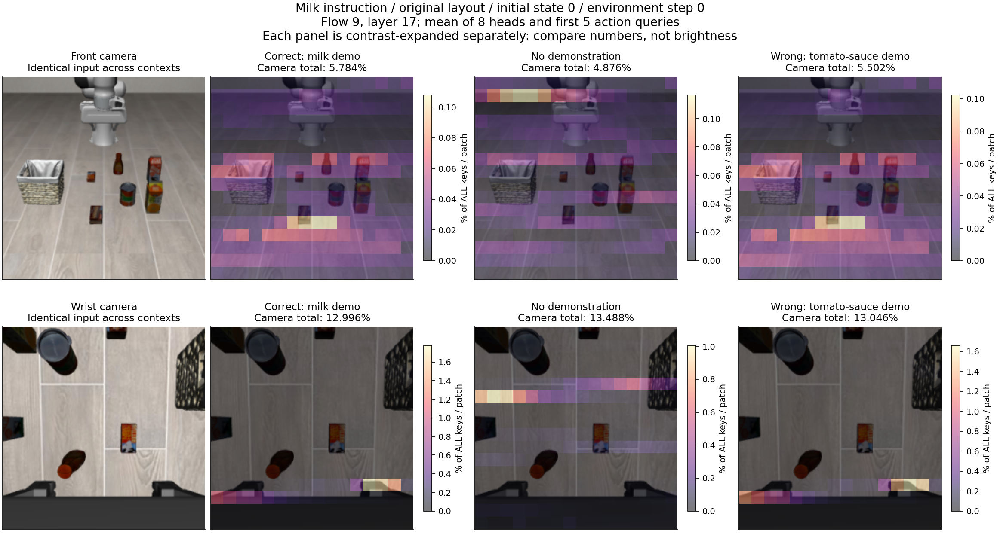
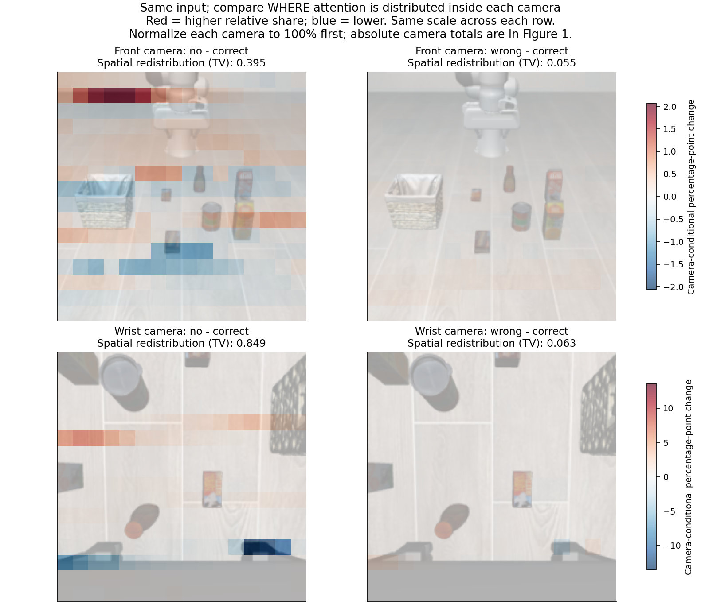
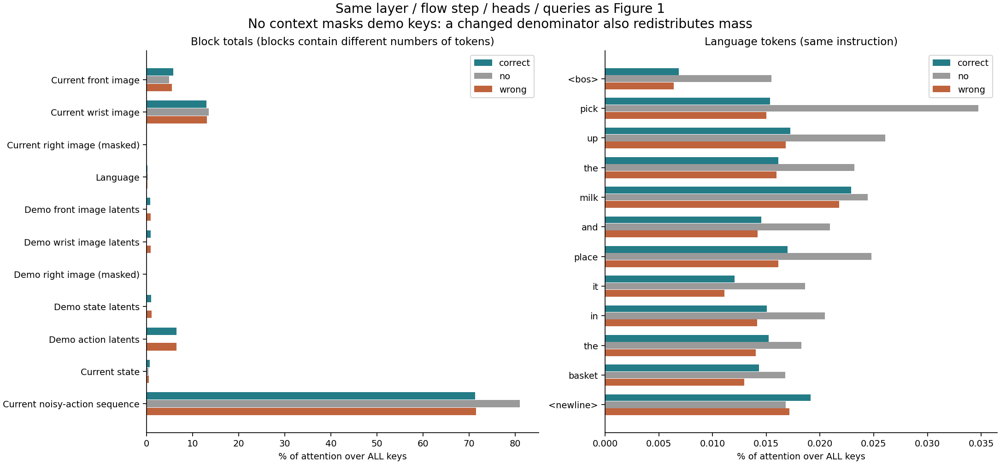

# 牛奶任务：correct / no / wrong context 的初始注意力对照

先看 [交互页面](index.html) 或下面的并排图。主例沿用教程的 episode 0；另外 4 个初始状态只用来检查这个现象是否重复出现，没有挑选更好看的热图。

## 比较口径

- **同一牛奶指令、原始布局、环境第 0 步**；correct 提供牛奶示范 episode 814，wrong 提供番茄酱示范 episode 821，no 关闭全部示范模态。
- 每个初始状态内，三种 context 的当前图像、机器人状态、语言 tokens/mask、初始模拟器状态 hash、初始动作噪声、PRNG key 均核对为完全相同。只在 context 处理上不同。
- 默认沿用教程：Gemma 层 17、采样步 9、8 个 heads 平均、前 5 个 action queries 平均，不包含 state query。
- 本次只读取实验 0 的 15 份记录，不新增推理或 rollout，不分析第 80/160 步。
- 注意：相同初始噪声不代表后面每个采样步的动作候选相同。更换 context 会改变前面更新得到的动作，最终层/步的差异包含这一累积过程。页面可切换采样步 0，查看尚未经历前面采样更新的情形；同一前向内部的早期层仍会受 context 影响。

## 1. 三种 context 并排看



每行是一个相机，第一列是三组共用的原图；后面依次是 correct、no、wrong。**每张热图分别放大颜色**以看清位置，不能只凭亮度比较组间大小；相机总量写在图标题里，每张图也有自己的绝对色条。交互页面还提供“同相机、跨 context 共用刻度”，只在当前选择的三组中确定范围，不再被其他层或另一台相机的极值压暗。

默认初始状态 0 的总量：

| context | 主视角 | 手腕视角 | 语言 | 当前采样步的动作序列 |
|---|---:|---:|---:|---:|
| correct | 5.784% | 12.996% | 0.186% | 71.285% |
| no | 4.876% | 13.488% | 0.261% | 81.010% |
| wrong | 5.502% | 13.046% | 0.176% | 71.460% |

## 2. 分清总量变化与空间重分配



差值图先把**每个相机内部**的 256 个权重归一化到总和 1，再计算 `no - correct`、`wrong - correct`。红色表示该位置在本相机内部的份额增加，蓝色表示减少。数值单位是百分点，与主图“对全部 keys 的百分比”不同；它刻意去掉相机总量变化，专门比较空间分布。同一相机的两个差值图使用相同的正负颜色范围。

使用 TV = `0.5 × sum(abs(归一化分布A - 归一化分布B))` 描述空间重分配，范围 0–1；0 表示分布完全相同，1 表示完全不重叠。它不是显著性检验、正确率，也不是“多少物体改变了注意力”。

| 初始状态 | 主视角 no−correct | 主视角 wrong−correct | 手腕 no−correct | 手腕 wrong−correct |
|---|---:|---:|---:|---:|
| 0 | 0.395 | 0.055 | 0.849 | 0.063 |
| 1 | 0.453 | 0.058 | 0.825 | 0.080 |
| 2 | 0.421 | 0.060 | 0.835 | 0.071 |
| 3 | 0.492 | 0.050 | 0.821 | 0.061 |
| 4 | 0.442 | 0.051 | 0.842 | 0.065 |

在这 5 个固定初始状态、默认层/步及平均方式下，**关闭示范引起的空间分布变化，明显大于把牛奶示范换成番茄酱示范引起的变化**。correct 与 wrong 的分布并非相同，但变化较小。这一比较描述当前记录，不外推为所有层、所有时刻或所有任务的结论。

## 3. 语言与全部 keys 的权重



no-context 中示范 keys 被屏蔽，softmax 的可用 keys 集合变了。因此其他部分总量改变既可能包含重新归一化的影响，也可能包含隐藏表征和动作候选改变的影响，不能全部解释为“模型更依赖某模态”。上面的相机内归一化差值可以排除简单的相机总量缩放，但仍不是因果贡献分解。

还有一个具体结构变化：correct/wrong 的有效 prefix token 数为 **652**，no 为 **524**。原模型根据有效 prefix 数计算 suffix 的位置编号，所以第一个 action token 的位置编号从 **653** 变成 **525**（减少 128）；图像的有效位置编号不随之平移。这意味着 no 干预同时改变了示范信息、可用 keys 和 action 相对图像的位置编码。热图位置的大幅变化可能包含这些因素，不能单独归为示范语义的作用；本次没有为拆开这些因素新增对照。

## 当前可以下到哪一步结论

1. 三种 context 的输入配对成立，可以把此次推理中出现的差异归于 context 干预及其下游计算过程，而非初始画面不同。
2. 默认视图中，no-context 对空间 attention 分布的改变很明显；correct/wrong 的差别较小，且这个相对关系在其余四个初始状态重复出现。
3. **这些平均热图目前不足以证明“错误示范把注意力明确从牛奶转移到了番茄酱”。** 没有加入物体分割/投影区域，不能把背景或夹爪的热点自动算到某个物体。也不能因为 correct/wrong 热图接近，就断言示范不影响行为：动作 token、value 向量、其他层/head 和残差仍可能不同。
4. 先据此判读图像，再决定是否增加更细的 head/query 分析或干预；本次没有自动扩大到其他任务、布局、环境步或遮挡实验。

## 数据与复现

- [汇总数值](summary.json)、[模态总量 CSV](block_masses.csv)、[空间差异 CSV](spatial_differences.csv)。
- [平均前向记录](averaged_attention.npz)：每个初始状态/context 保存 3 个采样步 × 3 层 × 1027 keys 的 head/query 平均结果；原始全 heads/queries 仍在实验 0 目录。
- [来源 SHA256](provenance.json)。
- `ep001` 到 `ep004` 各有与主例相同格式的三张图，也可在交互页面切换。

```bash
source scripts/activate_env.sh train
python -m scripts.attention.compare_contexts \
  --run logs/attention_capture/experiment0_consistency_20260923_143830 \
  --output logs/attention_analysis/milk_original_three_contexts_new
```
