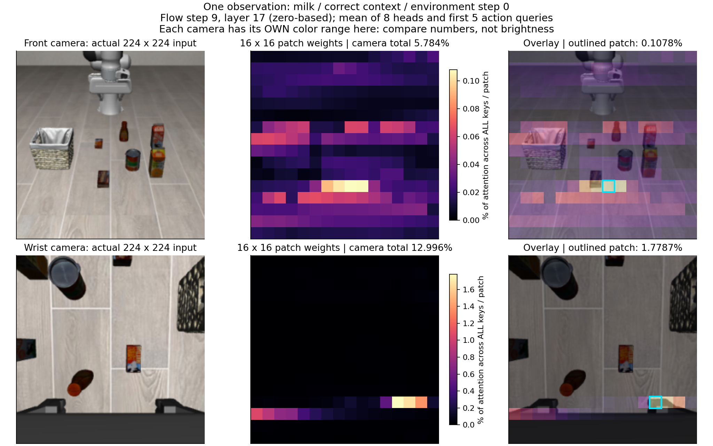
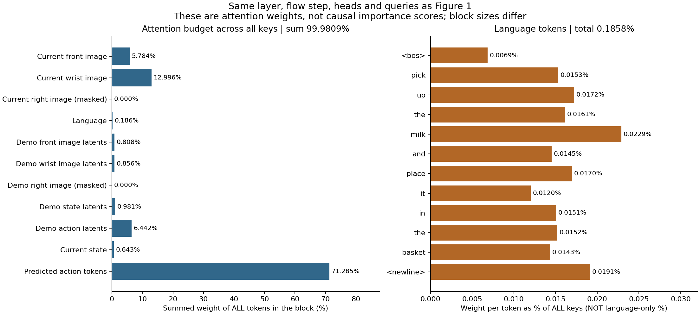
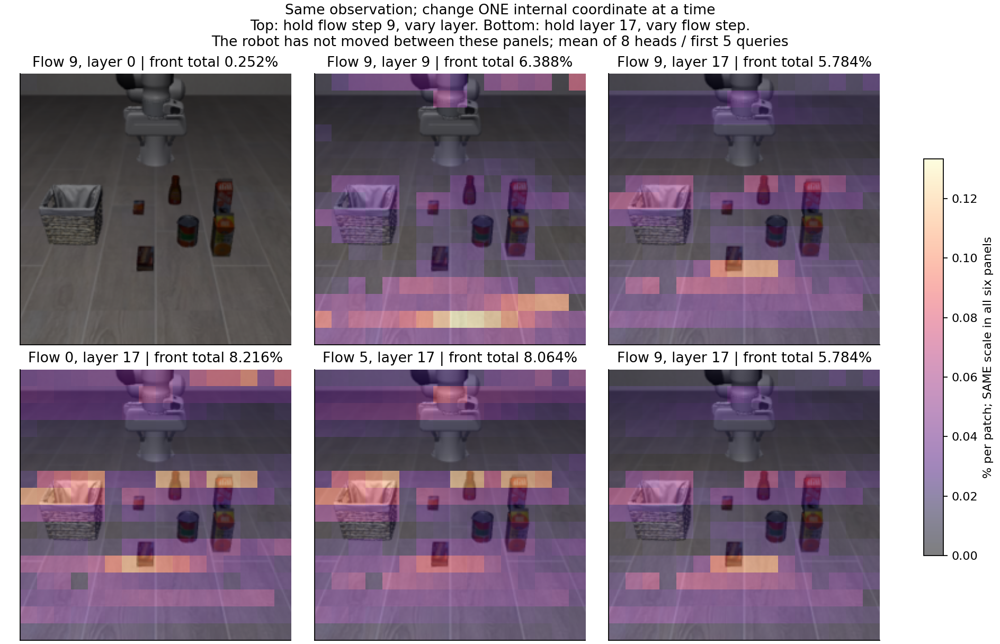

# 用一个例子读懂 attention

先打开 [交互式讲解 index.html](index.html)（下载后用浏览器直接打开即可，不需要启动服务），或按下面三张图顺序阅读。本次只处理实验 0 保存的数据，没有重新运行模型或机器人。

## 1. 固定我们正在看的那一次计算

来源：`original/correct/milk/ep000_step000`。原始布局，语言“把牛奶放入篮子”，正确牛奶示范，episode 0，环境第 0 步，机器人尚未执行本轮预测动作。该案例按固定条件选取，没有根据热图效果筛选。

主图固定：**采样步 9、层 17；8 个 heads 求平均；前 5 个 action queries 求平均。** 层和采样步从零计数，因此是第 10 次采样更新、第 18 层。前 5 个位置对应本轮实际执行的动作范围；这里记录的是它们在最后一次更新内部的 attention，不是最终动作的重要性分解。每个 action token 对应一个动作时间位置，不是一个 x/y 坐标分量。

三个层次：

- **环境步**：机器人实际执行到哪里。本例为 0。
- **采样步**：在当前观测下，从噪声逐步得到动作序列的内部计算。一次预测有 10 次更新；图里的 0/5/9 不是机器人运动的时间点。
- **Transformer 层**：每次采样计算依次经过多层网络，图里的 0/9/17 是不同深度。一个 head 是同一层中的一组注意力计算；本图对 8 组取平均，可能掩盖某个 head 的特殊分布。

## 2. 从原图到热图



左列是实际送入模型的 224×224 图像（已经使用原评估的方向与尺寸，不再翻转）。中列是 16×16 个 patch 的注意力。每格对应输入图像的 14×14 像素；右列把中列叠在原图上，青色框标出该相机权重最大的 patch，**不是物体检测框**。没有平滑插值，以免让粗粒度格子看起来像精确分割。

主视角最亮格为第 **11 行、第 8 列**（从零计数），对应 x∈[112, 126)、y∈[154, 168) 像素。它占全部 keys 的 **0.1078%**，占主视角图像自身注意力的 **1.86%**。这是同一个数用两个不同分母表达。

本图为了看清每个相机内部分布，**两个相机各用自己的颜色上限**，上限标在色条上。不能用两行的颜色亮度比较哪台相机权重更大。交互页面默认使用所有视图共享的绝对刻度，并提供“各相机放大颜色”的切换，可亲自观察同一份数据怎样因为配色不同而显得更亮。

特别注意：图像 token 在进入这些层前已经经过 SigLIP 等上下文计算，能混合其他位置的信息。因此它有空间位置索引，但不等于“只来自这块像素的信息”。本图是 action query → 当前图像位置 token 的直接 attention，**不是像素级因果归因，也不是跨层 attention rollout**。

## 3. 先看分配总量，再看局部热点



| keys 部分 | 有效 token 数 | 对全部 keys 的权重 |
|---|---:|---:|
| 当前主视角图像 | 256 | 5.7843% |
| 当前手腕图像 | 256 | 12.9960% |
| 当前右手图像（屏蔽） | 0 | 0.0000% |
| 语言 | 12 | 0.1858% |
| 示范主视角压缩 token | 32 | 0.8077% |
| 示范手腕压缩 token | 32 | 0.8559% |
| 示范右手图像（屏蔽） | 0 | 0.0000% |
| 示范状态压缩 token | 32 | 0.9815% |
| 示范动作压缩 token | 32 | 6.4421% |
| 当前状态 | 1 | 0.6425% |
| 预测动作 token | 50 | 71.2850% |

主视角总量 **5.784%**，手腕总量 **12.996%**。各项总和为 **99.9809%**，与 100% 的微小差异来自原 BF16 概率舍入；这里没有重新归一化。图中语言每个 token 的百分比也以全部 keys 为分母，没有把语言单独放大到 100%。`<bos>` 和换行符保留，padding 不展示且权重为零。

预测动作 token 的权重很大，是因为 action queries 也允许关注动作序列内部的 keys。不能据此断言它“主要依赖自身、不看图像”：这里还没有考虑 value 向量、残差、其他层和已有的信息融合。同样，语言的直接权重较低，也不能据此判断语言没有用。

各部分 token 数不同，求和权重并不是天然公平的模态重要性评分；[blocks.csv](blocks.csv) 同时保存 token 数和每个有效 token 的平均权重，供检查口径。

## 4. 层和采样步究竟改变了什么



上排固定采样步 9，只换层；下排固定层 17，只换采样步。六张图中的相机画面完全相同，机器人没有在它们之间移动。六张图共用一个颜色刻度，便于比较。它们展示同一动作生成过程的不同计算位置，不是机器人从左到右移动的轨迹；也不能预先假设越深就越聚焦目标。

## 5. 这些图的计算口径

原始概率维度为 `[采样步, 层, batch, head, query, key]`。主图计算：

```python
# 2 对应保存列表中的 step 9 / layer 17；query 0 是 state，因此排除。
a = probabilities[2, 2, 0, :, 1:6, :].astype(float).mean(axis=(0, 1))
front_heatmap = a[0:256].reshape(16, 16)
front_total = a[0:256].sum()
language_total = a[768:816].sum()
```

选定 head/query 的注意力行在全部合法 keys 上约等于 1。平均后依然如此，再取指定 keys 求和或按 patch 排列。没有对单张热图除以其最大值来重新定义概率，也没有跨层相乘。

## 本例能回答和不能回答的问题

能回答：在这一层、这一采样步、这一组 queries 和 heads 上，哪些 token 获得了多少直接注意力，以及它们在当前图像的位置。

不能回答：模型是否识别了牛奶、是否按位置而非物体行动、语言和示范谁控制了行为、遮住亮区是否一定改变动作。这些需要跨条件分析及后续干预，不能凭这一个示例下结论。本例也没有生成示范图像内部的空间热图。

数据：[summary.json](summary.json)、[averaged_attention.npz](averaged_attention.npz)、[provenance.json](provenance.json)。本次新增生成脚本 `scripts/attention/make_tutorial.py` 和网页模板 `scripts/attention/tutorial.html`，没有修改模型或原始实验数据。
