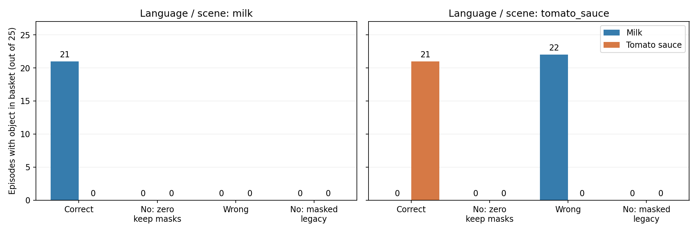

# No-context 补充实验：示范表示置零，保留 mask 和位置编号

已完成：两个任务各 25 次，共 50 次，原始的各自任务场景。correct/wrong 复用原实验记录。

**新 no 的 50 次试验仍没有牛奶或番茄酱入篮。因此，旧 no 的零成功率在这次保留 mask/位置编号的置零干预中也出现了；不能只用位置编号变化解释旧结果。**

| 当前语言 / 场景 | 条件 | 牛奶入篮 | 番茄酱入篮 |
|---|---|---:|---:|
| milk | 完整正确示范（历史） | 21/25 | 0/25 |
| milk | 无示范内容：表示置零、保留 mask（新） | 0/25 | 0/25 |
| milk | 完整错误示范（历史） | 0/25 | 0/25 |
| milk | 旧 no：关闭示范 mask（历史） | 0/25 | 0/25 |
| tomato_sauce | 完整正确示范（历史） | 0/25 | 21/25 |
| tomato_sauce | 无示范内容：表示置零、保留 mask（新） | 0/25 | 0/25 |
| tomato_sauce | 完整错误示范（历史） | 22/25 | 0/25 |
| tomato_sauce | 旧 no：关闭示范 mask（历史） | 0/25 | 0/25 |

表图仅统计牛奶与番茄酱。历史 wrong/milk 组虽然这两项都是 0/25，但原实验额外物体回放已确认奶油奶酪入篮 25/25，不能将该组解读为没有操作物体。本次新 no 没有任何场景物体入篮。

## 干预的确切含义

- 原 no：示范原始数据置零，示范 mask=false；token 槽位并未物理删除，但有效位置编号变了。
- 新 no：先按完整示范路径得到表示，再在进入 Gemma 前把示范图像、状态、action 的全部 160 个 token 槽位置零；保持原 mask，原来有效的 128 个位置继续有效，缺失右相机仍无效。当前图像、语言、本体状态不变。
- 牛奶 gate 样例首个 action 位置编号保持 653，旧 masked no 为 525。所有实际采集点均验证新 no 与完整示范 prefix 的 mask、位置编号和非示范内容精确相同。
- 这不是把原始像素/状态/action 数值设为 0 后再编码；编码器的偏置或位置表示不会以这种方式残留为示范内容。
- 零表示仍是可能的 OOD 输入，不是训练过的“无示范”表示；有效零 token 后续可以融合其他信息，attention 不要求为零。

## 验证和记录

- 50 回合逐一与历史 correct/no/wrong 核对：初始模拟器状态、观察哈希、环境种子、56 次推理噪声全部一致。每回合固定 280 步、每 5 步重规划，初始状态索引 0–24。
- 6 份历史快照的完整模型 raw/executable actions 与实验 0 保存结果逐字节一致。
- 两个任务 gate 验证：改变全部示范数值，或换另一任务示范，置零后动作完全相同；示范内容没有绕过干预进入输出。
- 保存 150 份 attention（每回合 0/80/160 步），每份记录开/关动作精确一致，并与实际执行的 5 步动作核对。仅保存，不分析热图。
- 检查点参数 hash 运行前后相同。所有 50 个视频按 20 FPS 保存，位于指令命名的子目录。
- 新 no 的全部场景物体入篮计数：`{"milk": {}, "tomato_sauce": {}}`。计数可能包括干扰物，不能只依据牛奶/番茄酱失败宣称机器人完全不动。

## 结论范围

新旧 no 在相同初始观察和噪声下，有 50/50 回合的第一步动作不同。因此，成功率即使相同，也不能说两种干预产生了相同的行为；差值保存在逐回合 CSV。

本次补充只针对 20260922_154452 的原 Correct / No / Wrong 实验。固定番茄酱场景、位置交换实验的 no 分组，以及实验 0/1 和 action 消融报告引用的历史 no 记录均未重跑，不能将这里的新数值替换到那些条件中。Table 1 完整示范复现不受此干预影响。

即使新旧 no 都失败，也不能证明位置编号对行为完全没有影响，或证明模型不理解语言；两个对照都可能受 OOD 影响。要单独隔离位置编号，还需保持 attention 可见性不变的另一组控制。

[逐回合配对视频](VIDEO_INDEX.md) · [机器可读对照](comparison.json) · [逐回合结果](paired_outcomes.csv) · [代码修改报告](CODE_CHANGES.md)
