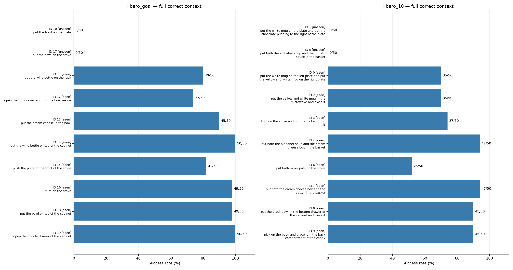
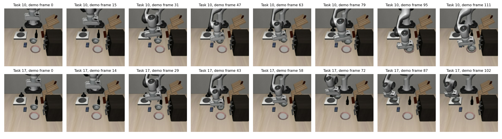
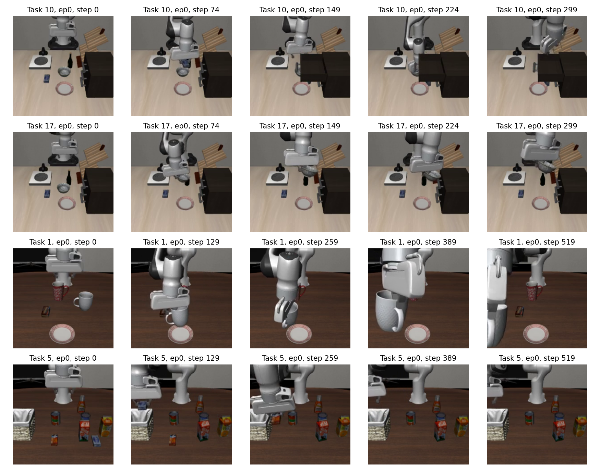

# ContextFlow：Goal / Long 全任务评估

已完成 20 个任务 × 50 次，共 1,000 回合。先评估论文指定的 4 个 unseen 任务，再评估其余 16 个 seen 任务。所有回合使用完整正确示范。

## 首先修正训练范围的理解

论文 §4.1 表明训练使用四个 suite；Table S4 每个 suite 划出两个 unseen 任务。发布配置 `remove_task_list=LIBERO_UNSEEN_TASKS` 和本地数据元信息与之相符。因此 Goal/Long 其余任务属于 seen，不是额外的 unseen 泛化任务。[论文](https://arxiv.org/html/2609.06852v1)

这是按论文和发布配置判定的划分；检查点没有附带可独立审计的完整训练数据日志，不能仅从权重反推出实际训练样本。

## 与论文 Table S3 对照

| Suite | 划分 | 本次成功数 | 本次成功率 | 论文成功率 |
|---|---|---:|---:|---:|
| libero_goal | unseen (2 tasks) | 0/100 | 0.00% | 0.0% |
| libero_goal | seen (8 tasks) | 361/400 | 90.25% | 90.0% |
| libero_10 | unseen (2 tasks) | 0/100 | 0.00% | 0.0% |
| libero_10 | seen (8 tasks) | 317/400 | 79.25% | 82.0% |

**四个论文 unseen 任务均为 0/50，复现了该检查点在这些任务上的零观测成功率。** 0/50 不是对真实成功概率严格为零的证明；逐任务的 Wilson 95% 区间见 CSV。

本次仅评估 run1/19999 这一个检查点、每任务一条固定正确示范；50 回合覆盖官方初始状态，不代表对不同示范和训练运行取平均。论文汇总用于参照，不要求 seen 成功率逐点相等。

## 全部任务成功率

| Suite | 数据集 ID | 划分 | 原始任务指令 | 成功数 | 成功率 |
|---|---:|---|---|---:|---:|
| libero_10 | 1 | unseen | put the white mug on the plate and put the chocolate pudding to the right of the plate | 0/50 | 0% |
| libero_10 | 5 | unseen | put both the alphabet soup and the tomato sauce in the basket | 0/50 | 0% |
| libero_10 | 0 | seen | put the white mug on the left plate and put the yellow and white mug on the right plate | 35/50 | 70% |
| libero_10 | 2 | seen | put the yellow and white mug in the microwave and close it | 35/50 | 70% |
| libero_10 | 3 | seen | turn on the stove and put the moka pot on it | 37/50 | 74% |
| libero_10 | 4 | seen | put both the alphabet soup and the cream cheese box in the basket | 47/50 | 94% |
| libero_10 | 6 | seen | put both moka pots on the stove | 26/50 | 52% |
| libero_10 | 7 | seen | put both the cream cheese box and the butter in the basket | 47/50 | 94% |
| libero_10 | 8 | seen | put the black bowl in the bottom drawer of the cabinet and close it | 45/50 | 90% |
| libero_10 | 9 | seen | pick up the book and place it in the back compartment of the caddy | 45/50 | 90% |
| libero_goal | 10 | unseen | put the bowl on the plate | 0/50 | 0% |
| libero_goal | 17 | unseen | put the bowl on the stove | 0/50 | 0% |
| libero_goal | 11 | seen | put the wine bottle on the rack | 40/50 | 80% |
| libero_goal | 12 | seen | open the top drawer and put the bowl inside | 37/50 | 74% |
| libero_goal | 13 | seen | put the cream cheese in the bowl | 45/50 | 90% |
| libero_goal | 14 | seen | put the wine bottle on top of the cabinet | 50/50 | 100% |
| libero_goal | 15 | seen | push the plate to the front of the stove | 41/50 | 82% |
| libero_goal | 16 | seen | turn on the stove | 49/50 | 98% |
| libero_goal | 18 | seen | put the bowl on top of the cabinet | 49/50 | 98% |
| libero_goal | 19 | seen | open the middle drawer of the cabinet | 50/50 | 100% |

## Long 的部分目标完成情况

这些是 BDDL 目标谓词，不是自动识别的动作基元。整任务成功要求同一时刻全部成立；不同时间分别成立不会累计成整任务成功。初始已满足的条件不代表模型执行了相应操作。

| Task ID | 目标谓词 | 初始满足 | 曾满足 | 结束时满足 | 初始不满足而后来满足 |
|---:|---|---:|---:|---:|---:|
| 5 | `in alphabet_soup_1 basket_1_contain_region` | 0/50 | 0/50 | 0/50 | 0/50 |
| 5 | `in tomato_sauce_1 basket_1_contain_region` | 0/50 | 0/50 | 0/50 | 0/50 |
| 7 | `in cream_cheese_1 basket_1_contain_region` | 0/50 | 49/50 | 49/50 | 49/50 |
| 7 | `in butter_1 basket_1_contain_region` | 0/50 | 48/50 | 48/50 | 48/50 |
| 3 | `turnon flat_stove_1` | 0/50 | 50/50 | 50/50 | 50/50 |
| 3 | `on moka_pot_1 flat_stove_1_cook_region` | 0/50 | 37/50 | 37/50 | 37/50 |
| 8 | `close white_cabinet_1_bottom_region` | 0/50 | 45/50 | 45/50 | 45/50 |
| 8 | `in akita_black_bowl_1 white_cabinet_1_bottom_region` | 0/50 | 48/50 | 47/50 | 48/50 |
| 0 | `on porcelain_mug_1 plate_1` | 0/50 | 36/50 | 36/50 | 36/50 |
| 0 | `on white_yellow_mug_1 plate_2` | 0/50 | 47/50 | 46/50 | 47/50 |
| 9 | `in black_book_1 desk_caddy_1_back_contain_region` | 0/50 | 45/50 | 45/50 | 45/50 |
| 1 | `on porcelain_mug_1 plate_1` | 0/50 | 6/50 | 2/50 | 6/50 |
| 1 | `on chocolate_pudding_1 living_room_table_plate_right_region` | 0/50 | 0/50 | 0/50 | 0/50 |
| 4 | `in alphabet_soup_1 basket_1_contain_region` | 0/50 | 49/50 | 48/50 | 49/50 |
| 4 | `in cream_cheese_1 basket_1_contain_region` | 0/50 | 47/50 | 47/50 | 47/50 |
| 6 | `on moka_pot_1 flat_stove_1_cook_region` | 0/50 | 29/50 | 28/50 | 29/50 |
| 6 | `on moka_pot_2 flat_stove_1_cook_region` | 0/50 | 41/50 | 37/50 | 41/50 |
| 6 | `turnon flat_stove_1` | 50/50 | 50/50 | 50/50 | 0/50 |
| 2 | `in white_yellow_mug_1 microwave_1_heating_region` | 0/50 | 37/50 | 36/50 | 37/50 |
| 2 | `close microwave_1` | 0/50 | 35/50 | 35/50 | 35/50 |

论文两个 Long unseen 的目标条件分别为：

- Task 1：`on porcelain_mug_1 plate_1` 曾满足 6/50，最后满足 2/50；`on chocolate_pudding_1 living_room_table_plate_right_region` 曾满足 0/50，最后满足 0/50。
- Task 5：`in alphabet_soup_1 basket_1_contain_region` 曾满足 0/50，最后满足 0/50；`in tomato_sauce_1 basket_1_contain_region` 曾满足 0/50，最后满足 0/50。

这些统计区分各个目标从未完成与仅完成部分目标，但不能把目标条件直接等同于时序动作基元。要严格研究组合泛化，还需在同布局下分别验证每个单项操作及其组合；本轮不额外改变指令或示范来做这项干预。

## 对研究切入点的解释

Goal 的两个 unseen 都是放碗任务，可与 seen 的“碗放到柜顶”等任务对照；这一比较比“整个 Goal 都未训练”更准确。Goal suite 同时包含开抽屉、开炉子、推盘子，Long 也包含单目标放书和开关器具的组合，不能仅依据 suite 名称把所有任务分成单基元/双基元。

已直接比较 Task 10（碗放盘子）、17（碗放炉子）、18（碗放柜顶）的 BDDL：物体、fixtures、区域、场景属性和初始关系完全一致，目标与语言不同；官方具体初始状态数组不相同，见 goal_scene_comparison.json。因此这里可以重点研究同场景分布下改变放置目标的泛化，但当前不是逐初始状态匹配的因果对照。

本实验能定位哪个目标/布局会失败，并通过 Long 的目标谓词区分部分完成与完全失败。成功率差异本身不能证明失败来自组合推理；还可能涉及目标位置、操作高度、示范压缩、轨迹分布等。这里没有做位置、语言或示范模态干预，也没有用 attention 作因果解释。

## 实际示范与回合 0 画面

已补充 [完整示范与评估并排播放页](demonstrations/index.html) 和 [全部 20 个任务的示范视频索引](demonstrations/README.md)。页面首先展示 Task 1、5，以及含汤罐的 seen Task 4。完整视频与模型实际采样的 8 帧分别展示，10/20 FPS 含义在页面中标明。

下面展示的是服务实际收到的两条 Goal 示范，而非另选的示意轨迹。两条示范分别把碗送向盘子和炉子。四个 unseen 的 rollout 均固定选 episode 0，避免按成败挑选展示案例；画面只能说明这些样例，不作为全部回合的行为分类统计。

## 协议与实现细节

- 检查点：`ContextFlow_run1/19999`；普通 ContextFlow 模型，float32 权重与 JAX matmul precision，Gemma 内部仍按原配置 bfloat16。没有零化、删除或关闭示范 mask。
- 每任务取数据集同任务的第一条演示，固定供 50 次推理使用。沿用全轨迹均匀采样 8 帧图像、最多 128 个状态/action 点及原 Perceiver 压缩。Long 使用一条完整组合任务示范，不拼接两条单任务示范，也不提供阶段切换信号。具体 episode/采样帧索引见 task_manifest.json。短于 128 帧时原加载器重复末尾 state/action 补齐；本次 Goal 两条 unseen 示范分别补 25、16 个重复位置，未修改该策略。
- 每个任务重置环境随机种子 7 和策略 key(0)，随后沿用原连续 split 随机流，使用官方初始状态 0–49。任务间独立可并行；这与此前每 suite 连续策略随机流的部署安排不同，因此不是承诺逐帧复刻作者未公开的随机流。
- 等待 10 个稳定步，Goal 最多执行 300 步，Long 最多 520 步。每 5 步重新规划，50 步动作窗口、10 步 flow 采样。完整目标首次成功就停止，失败跑满时限，不使用先前消融实验的固定 280 步规则。
- 错误会终止评估，不计为策略失败；不会筛选初始状态、补种子到指定成功率或给 Long 的单个子目标记完整成功。
- 视频按原速 20 FPS 保存在每任务的指令目录；保留逐步动作、仿真状态、末端/夹爪状态、目标谓词、初始图像和每次推理的 RNG key。没有为本实验采集 attention。

## 验证与材料

- 八个服务各自通过历史完整示范样本的 raw/executable action 逐字节一致性检查；运行前后模型参数 hash 一致：`19e92cff3ca1839d800da29b2f8362e8058522556bd316164d6bd00243d6b4d4`。
- 1,000 条轨迹的完整目标与逐步谓词、JSON 成功计数一致；52972 次推理的 RNG 序列、示范 episode 均已核对。20 个任务首次输入保留了所有有效示范 token，审计快照见 servers/。
- 逻辑 worker 5 两次在启动参数读取检查时停滞，未开始回合；迁移到物理 GPU 0 后通过同一数值检查，完成原定任务。其余回合不重抽。资源映射与清理记录见 provenance/startup_recovery.json。
- [逐任务 CSV](success_rates.csv)、[seen/unseen 汇总](suite_summary.csv)、[全部目标谓词 CSV](goal_clause_rates.csv)、[完整 JSON](comparison.json)、[视频入口](VIDEO_INDEX.md)、[代码修改报告](CODE_CHANGES.md)。
