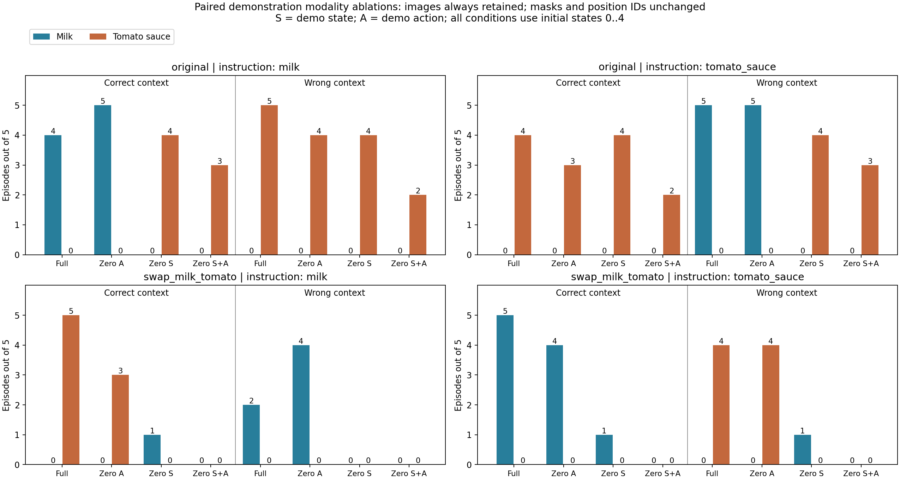

# 示范 state / state+action 表示消融结果

完成两个新实验，各 40 回合，共 80 回合。每个条件使用同一批 5 个初始状态；所有示范图像内容均保留。与历史完整示范和仅 action 置零逐回合配对，不拿 5 次比例与 25 次总比例比较。

**示范原位置上的物体入篮：完整示范 34/40；去 action 32/40；去 state 9/40；同时去 state/action 4/40。**

## 主要判读

**在本次配对试验和表示置零干预下，示范 state 对维持‘随示范切换操作目标’的行为比显式 action 更关键。去掉 action 后这一行为基本保留；去掉 state 后，即使图像和 action 都保留，也未观察到一对回合成功切换入篮物体。但执行失败也增加了，所以这不是原模型完全不使用图像/action 的证据。**

更直接对应“固定语言，只换示范，行为是否跟着变”的指标是：20 对 correct/wrong 回合中，成功入篮物体随示范切换的配对数为完整示范 14/20、去 action 13/20、去 state 0/20、去 state/action 0/20。完整示范和去 action 的这些切换都对应示范的原位置。

去 state 后，原布局有 16/20 回合将番茄酱放入篮子；交换后有 3/20 回合将占据原番茄酱区域的牛奶放入篮子。分组表显示了其对语言/示范的变化响应。这个结果与偏向某个固定区域相容，但成功回合数有限，不能把其余未成功回合的目标选择自动补成同一种。

## 四种条件的对照

| 条件 | 保留的示范内容 | 示范原位置上的物体入篮 | 语言目标入篮 | 两目标均未入篮 |
|---|---|---:|---:|---:|
| 完整示范 | 图像 + state + action | 34/40 | 14/40 | 6/40 |
| 仅 action 置零 | 图像 + state | 32/40 | 16/40 | 8/40 |
| 仅 state 置零 | 图像 + action | 9/40 | 9/40 | 21/40 |
| state/action 同时置零 | 仅示范图像 | 4/40 | 5/40 | 30/40 |

“示范原位置上的物体”用于检查按示范位置操作的倾向：例如牛奶示范在交换后，其原区域由番茄酱占据，番茄酱入篮就计入该列。它不是语言成功率，也不表示找到了示范中的同类物体。

所有条件保留当前图像、语言和机器人本体状态。表里的“仅示范图像”只针对示范部分，不是把模型所有其他输入移除。

## 分组行为

每个单元格为 **牛奶入篮次数 / 番茄酱入篮次数**，均以 5 次为分母；例如“奶 4 / 酱 0”表示牛奶 4/5、番茄酱 0/5。

| 布局 | 语言 | context | 完整示范 | 去 action | 去 state | 去 state/action |
|---|---|---|---|---|---|---|
| 原始 | milk | correct | 奶 4 / 酱 0 | 奶 5 / 酱 0 | 奶 0 / 酱 4 | 奶 0 / 酱 3 |
| 原始 | milk | wrong | 奶 0 / 酱 5 | 奶 0 / 酱 4 | 奶 0 / 酱 4 | 奶 0 / 酱 2 |
| 原始 | tomato_sauce | correct | 奶 0 / 酱 4 | 奶 0 / 酱 3 | 奶 0 / 酱 4 | 奶 0 / 酱 2 |
| 原始 | tomato_sauce | wrong | 奶 5 / 酱 0 | 奶 5 / 酱 0 | 奶 0 / 酱 4 | 奶 0 / 酱 3 |
| 交换位置 | milk | correct | 奶 0 / 酱 5 | 奶 0 / 酱 3 | 奶 1 / 酱 0 | 奶 0 / 酱 0 |
| 交换位置 | milk | wrong | 奶 2 / 酱 0 | 奶 4 / 酱 0 | 奶 0 / 酱 0 | 奶 0 / 酱 0 |
| 交换位置 | tomato_sauce | correct | 奶 5 / 酱 0 | 奶 4 / 酱 0 | 奶 1 / 酱 0 | 奶 0 / 酱 0 |
| 交换位置 | tomato_sauce | wrong | 奶 0 / 酱 4 | 奶 0 / 酱 4 | 奶 1 / 酱 0 | 奶 0 / 酱 0 |

为区分纠正 wrong context 与整体执行失败，单独看原布局：

| 条件 | 原布局 correct：语言目标成功 | 原布局 wrong：另一物体入篮 |
|---|---:|---:|
| 完整示范 | 8/10 | 10/10 |
| 仅 action 置零 | 8/10 | 9/10 |
| 仅 state 置零 | 4/10 | 4/10 |
| state/action 同时置零 | 2/10 | 2/10 |

交换布局中 wrong 的语言目标恰好处在示范原位置上，不能把这些成功自动解释成更服从语言。

额外物体：仅 state 置零 / swap_milk_tomato / tomato_sauce / correct / episode 003：chocolate_pudding_1 入篮（两目标分类为 neither）。`chocolate_pudding_1` 是巧克力布丁。其视频见对应配对索引；不能将 `neither` 理解成没有操作或放入任何物体。

## 固定语言，只换示范，入篮物体是否跟着变

每种条件有 20 对 correct/wrong 回合（两布局 × 两语言 × 5 初始状态）；这里的比较固定当前语言、初始状态和噪声，只切换示范任务。“其余配对”包括至少一个回合未完成两种目标，或两种物体都曾入篮，不能算作明确的目标切换。

| 条件 | 换示范后，两个回合入篮物体不同 | 其中两回合均对应示范位置 | 两回合均为同一物体 | 其余配对 |
|---|---:|---:|---:|---:|
| 完整示范 | 14/20 | 14/20 | 0/20 | 6/20 |
| 仅 action 置零 | 13/20 | 13/20 | 0/20 | 7/20 |
| 仅 state 置零 | 0/20 | 0/20 | 7/20 | 13/20 |
| state/action 同时置零 | 0/20 | 0/20 | 3/20 | 17/20 |

“其中两回合均对应示范位置”是“入篮物体不同”的子集；它更贴近此前观察到的按示范区域操作。这里统计完成入篮的行为，不将未成功入篮的回合说成没有抓取。

## 配对变化

| 配对干预 | 原位置入篮：成功 → 失败 | 失败 → 成功 |
|---|---:|---:|
| 完整示范 → 仅 state 置零 | 25/40 | 0/40 |
| 仅 action 置零 → state/action 同时置零 | 30/40 | 2/40 |
| 完整示范 → 仅 action 置零 | 7/40 | 5/40 |
| 仅 state 置零 → state/action 同时置零 | 6/40 | 1/40 |

这些是同初始状态的变化，不是仅用总数相减。逐回合四条件结果见 [paired_outcomes.csv](paired_outcomes.csv)，视频见 [VIDEO_INDEX.md](VIDEO_INDEX.md)。

## 实验控制与验收

- 固定番茄酱任务场景，原始 / 牛奶番茄酱 XY 交换两种布局，牛奶 / 番茄酱两条语言，correct / wrong 两种示范，每格初始状态索引 0–4；每回合 280 步，每 5 步重规划，10 个 flow 步。
- 仅 state 置零：Gemma 前的 32 个示范 state token（当前布局 912:944）置零，保留示范图像/action；state/action 同时置零：这 32 个 state 与 32 个 action token（944:976）置零，保留示范图像。不是对物理动作或原始状态输入做零值替代。
- 三种消融均保留原 token 槽位、mask、位置编号。每个新实验 12 份真实样本及全部 120 份 rollout capture 检查未消融 token 精确不变。
- 每个新服务核对 60 份历史快照的普通模型 raw/executable actions 逐字节相同；8 份 correct/wrong 样本验证被消融模态的数值单独/联合改变后输出精确不变；4 份旧 masked no 快照输出保持不变（仅用于诊断，不计入行为表）。
- 80 条新轨迹与历史完整示范、仅 action 置零的初始模拟器状态、观察、布局干预来源、示范 episode、每次推理噪声全部配对；逐步入篮谓词与 JSON 一致。
- 每个新实验保留 120 份 attention，共 240 份（环境步 0/80/160，flow 步 0/5/9，层 0/9/17，全 8 个头）；每份普通/记录动作完全相同，并与实际执行动作核对。暂不分析热图。
- 模型参数 hash 与上一轮相同，运行前后不变。视频 20 FPS，按指令分文件夹。

## 视频抽查

[原始 / 交换布局的示例画面](sample_video_frames.png)来自两种新干预的牛奶语言、correct context、episode 0，分别显示第 1/80/160/280 步。完整回放见[配对视频索引](VIDEO_INDEX.md)。成功表只统计 LIBERO 的入篮谓词，不把未成功入篮解释为没有选中、抓取或搬运物体。

## 解释边界

这是表示置零干预，可能产生 OOD；不能仅凭失败认定原模型不使用保留模态，也不能把“去 state”直接等同于去掉所有位置信息。示范图像与 action 仍可能含空间/运动信息，示范 state 也可能含运动过程。有效零 token 在后续层仍可融合其他信息。

四格对照允许分别看有/无 action 时移除 state 的影响，以及有/无 state 时移除 action 的影响。每格仅 5 次，这是与上一轮对齐的探索性试验，不做显著性声明，也不能据此断言模型唯一依赖某个模态。

本报告不混入 no-context：昨天的全示范置零补跑使用各自任务场景，而本次使用固定番茄酱场景；旧位置交换 no 又采用关闭 mask 的定义，都不是这里四格对照的一部分。

[代码修改报告](CODE_CHANGES.md) · [机器可读结果](comparison.json) · [attention 索引](attention_manifest.json)
