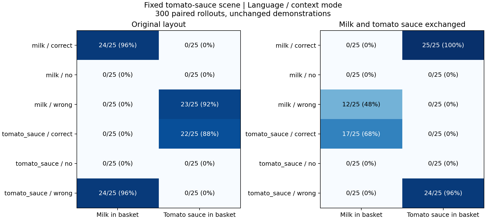
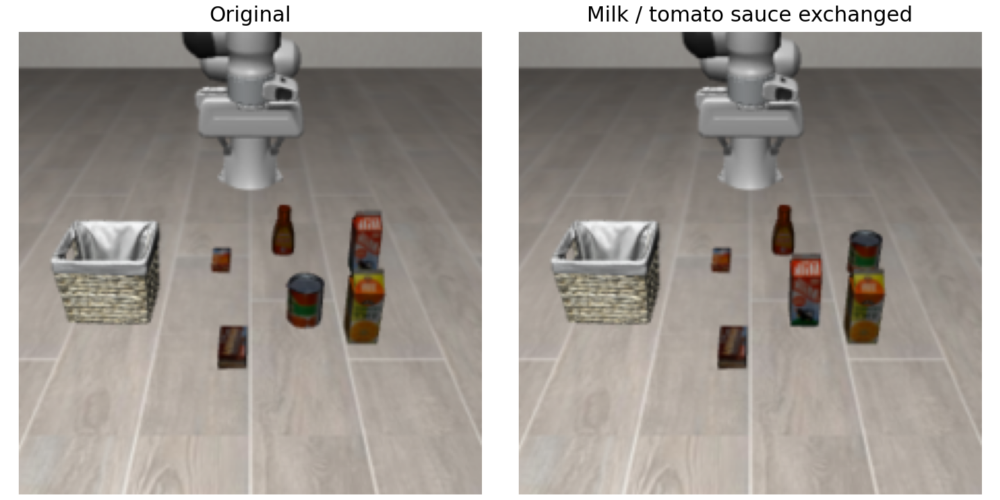

# 固定番茄酱场景：物体位置交换 × context 干预

2026-09-22。正式完成 12 组 × 25 回合 = **300 回合**。另有 12 个完整试跑回合，不计入正式统计。

## 结论

**在这个固定场景、检查点和两条示范下，结果更支持跟随示范中的空间／动作信息，而不是按示范物体身份重新定位。**
判断来自保持语言和示范不变、仅交换当前环境中两个物体的水平位置后，实际操作物体随位置占据者改变。
这不能进一步区分绝对坐标、相对空间关系或动作轨迹模仿，也不证明模型完全忽略语言。

## 完整结果

表内均为 25 回合中物体曾经满足 LIBERO `In` 入篮判据的次数，执行固定 280 步，不因任一目标成功提前结束。

| 语言 | context | 原布局：牛奶 / 番茄酱次数 | 交换布局：牛奶 / 番茄酱次数 |
| --- | --- | --- | --- |
| 牛奶 | correct | 24 / 0 | 0 / 25 |
| 牛奶 | no | 0 / 0 | 0 / 0 |
| 牛奶 | wrong | 0 / 23 | 12 / 0 |
| 番茄酱 | correct | 0 / 22 | 17 / 0 |
| 番茄酱 | no | 0 / 0 | 0 / 0 |
| 番茄酱 | wrong | 24 / 0 | 0 / 24 |

## 逐回合核对：交换前后，入篮物体是否改变

上图展示各组的总次数。这里进一步核对：**同一个初始状态，交换前后是否真的把不同物体放进了篮子。**
每个初始状态分别运行原布局和交换布局，两次保持语言、示范和推理随机数相同；只有两次都出现表中指定的入篮结果，才计入次数。

| 语言 | 示范 | 原布局入篮 → 交换后入篮 | 出现次数（共 25 对运行） |
| --- | --- | --- | ---: |
| 牛奶 | 牛奶 | 牛奶 → 番茄酱 | 24/25 |
| 牛奶 | 番茄酱 | 番茄酱 → 牛奶 | 11/25 |
| 番茄酱 | 番茄酱 | 番茄酱 → 牛奶 | 15/25 |
| 番茄酱 | 牛奶 | 牛奶 → 番茄酱 | 23/25 |

例如第一行：25 个初始状态中，有 24 个在原布局搬牛奶、交换后搬番茄酱，语言和示范始终都是牛奶。这是逐回合确认的对象变化。
完整逐回合统计见 [paired_object_switches.json](paired_object_switches.json)。

## 其他物体与失败回合

所有场景物体均逐步记录。`neither` 只表示牛奶和番茄酱均未入篮，不能理解成没有动作或没有操作其他物体。

- `original/wrong/milk`：`chocolate_pudding_1` 入篮 1/25。
- `swap_milk_tomato/correct/tomato_sauce`：`orange_juice_1` 入篮 1/25。

详见 [所有物体入篮统计](all_object_comparison.json) 和 [逐回合运动量](object_motion.jsonl)。
运动量是相对第一帧的最大位移／上升量，仅作行为描述，不自动当成“成功抓取”。

## 可直接观看的配对视频

视频均为 **20 FPS 原速**。每个指令文件夹下 25 个视频。下面选取固定语言／示范后，交换位置确实改变操作对象的同一回合：

| 语言 / 示范 | 初始状态索引 | 原布局 | 交换布局 |
| --- | ---: | --- | --- |
| 牛奶 / 牛奶 | 1 | [牛奶入篮](original/correct/videos/pick_up_the_milk_and_place_it_in_the_basket/ep001_language_only.mp4) | [番茄酱入篮](swap_milk_tomato/correct/videos/pick_up_the_milk_and_place_it_in_the_basket/ep001_other_only.mp4) |
| 牛奶 / 番茄酱 | 2 | [番茄酱入篮](original/wrong/videos/pick_up_the_milk_and_place_it_in_the_basket/ep002_other_only.mp4) | [牛奶入篮](swap_milk_tomato/wrong/videos/pick_up_the_milk_and_place_it_in_the_basket/ep002_language_only.mp4) |
| 番茄酱 / 番茄酱 | 1 | [番茄酱入篮](original/correct/videos/pick_up_the_tomato_sauce_and_place_it_in_the_basket/ep001_language_only.mp4) | [牛奶入篮](swap_milk_tomato/correct/videos/pick_up_the_tomato_sauce_and_place_it_in_the_basket/ep001_other_only.mp4) |
| 番茄酱 / 牛奶 | 0 | [牛奶入篮](original/wrong/videos/pick_up_the_tomato_sauce_and_place_it_in_the_basket/ep000_other_only.mp4) | [番茄酱入篮](swap_milk_tomato/wrong/videos/pick_up_the_tomato_sauce_and_place_it_in_the_basket/ep000_language_only.mp4) |

## 初始化与实验协议

- 固定场景：原 LIBERO-Object 番茄酱场景；语言分别使用牛奶和番茄酱指令。牛奶指令在这里属于组合控制条件，不是原牛奶场景的 benchmark 成功率。
- 检查点：`/data/zjc/workspace/models/ContextFlow/ContextFlow_run1/19999`；float32；不更新模型参数。
- 原始示范固定为：牛奶 task 25 / episode 814；番茄酱 task 28 / episode 821。交换环境位置时不改变示范图像、状态或动作。
- 同一套番茄酱场景初始状态 0–24 用于全部 12 组。恢复源状态后，只交换两个物体的 XY，保留各自 Z 和四元数；两种布局都将两个目标的速度置零，再等待 10 步。
- 环境种子：`28007 + episode_index`，与语言、context 和布局无关。
- 推理随机数：`fold_in(key(0), language_task_index, episode_index, replan_index)`；每 5 步重新规划。固定语言下，context 和布局之间完全配对。不同语言之间的推理随机数不强制相同，因此不将跨语言差异单独解释为语言的因果效应。
- `correct/wrong` 只表示示范物体是否符合语言，不随物体交换而重新命名；`no` 屏蔽全部示范模态，仍保留语言和当前观测。
- 每步记录全部物体位置和入篮谓词，并核对番茄酱谓词与原场景 `check_success()` 一致。牛奶语言目标使用牛奶自身的 `In` 判据。
- 物理检查在正式推理前完成：50 个布局初始化全部通过，最大水平漂移约 0.25 mm；最深接触约 0.021 mm，远小于严重穿透阈值。
- 六个独立服务并行运行六种“布局 × context”条件；两种语言依次评估。所有模型输入干预、示范和推理随机数均有记录。

## 验证

- 完成 300 个正式回合、300 个视频、300 份轨迹；视频均 280 帧、20 FPS，所有动作有限。
- 核对全部回合的源状态、布局内初始状态／观测、跨布局示范 episode 和每次推理随机数；保存的初始状态哈希与轨迹文件一致。
- 核对全部轨迹逐步谓词与 JSONL 入篮结果，检查实际干预只改变指定 XY；其他物体的干预瞬间位姿不变。
- 12 个完整试跑和相同编号正式回合的动作／物体轨迹完全一致。
- 交换布局试跑 `correct/milk/episode 0` 的原动作回放通过，机器人末端／夹爪、两种目标物体位置和谓词一致，最大轨迹误差 0。
- 15 项相关测试通过，新增与修改的 Python 文件 lint、shell 语法和差异空白检查通过。

## 遇到的问题及解决

1. 初始物体正常下落约 3.5 cm，触发最初 3 cm 高度阈值。调整为 8 cm，并增加落地速度检查，同时保留水平漂移、朝向和穿透检查；在正式试跑前重新验证全部 50 个状态，没有跳过或替换任何索引。
2. 辅助回放第一次审批超时，重试后执行。随后发现落地后多一次平坦状态恢复会引入微小轨迹偏差；删除该多余恢复，改为重复完全相同的初始化流程并逐位核对保存状态，回放达到零误差。正式评估流程不受影响。
3. 本地汇总脚本从 `.cache/` 启动时缺少项目根目录的 Python 模块搜索路径；补齐 `PYTHONPATH` 后完整核验和报告生成通过。发布入口使用 `python -m`，不受此临时脚本路径问题影响。

资源清理：六个评估进程均退出码 0，策略服务进程已确认不存在。最终 `nvidia-smi` 查询因自动审批服务连接失败被拒绝，未取得显存读数。

## 解释边界

这轮实验直接控制了物体身份与位置的对应关系，比上一轮不同场景间的示范互换更有区分力。但仍只有一个场景、两条固定示范和 25 个源初始状态，不能推断所有任务都如此。
交换后抓取失败或转向邻近物体，也可能来自示范动作与新物体形状不匹配；不能把每个失败回合都算作“按位置成功”。无示范失败还可能包含输入分布变化的影响。

## 复现与文件

`bash quickstart.sh` → **10** → **25** → 检查点、GPU、端口。菜单使用一个服务依次完成 12 组；本次用独立服务并行加速，配对随机数协议一致。
主汇总：[CSV](comparison.csv)、[JSON](comparison.json)、[运行配置](run.json)、[初始化验证](initialization_validation/validation.json)。
目录结构：`<layout>/<context>/videos/<instruction>/`，同条件下还有 `trajectories/`、`initial_views/`、`episodes.jsonl`。
本次报告、视频和结果仅保存在本地；位置交换代码尚未提交或推送。
